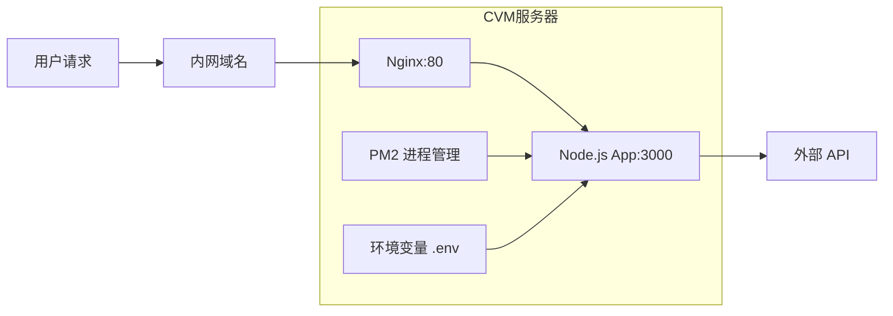

## Product Overview

将慧食 AI 项目部署到腾讯云 CVM 服务器，实现生产环境的完整部署方案。服务器配置为 TencentOS Server 4 系统，4核8G内存，通过内网域名提供访问服务。

## Core Features

- 服务器运行环境搭建：安装 Node.js、Nginx、PM2 等必要软件
- 项目代码部署：从代码仓库拉取项目并安装依赖
- 环境变量安全管理：将 API Key 从代码中移除，通过环境变量配置
- Nginx 反向代理配置：实现内网域名访问，代理转发到 Node.js 应用
- PM2 进程管理：确保应用持久化运行，支持自动重启
- 内网域名访问：通过用户配置的内网域名访问应用服务

## Tech Stack

- 操作系统：TencentOS Server 4 (基于 CentOS/RHEL)
- 运行时：Node.js 18.x LTS
- 进程管理：PM2
- Web 服务器：Nginx
- 版本控制：Git (已安装)

## Tech Architecture

### System Architecture

采用经典的 Nginx + Node.js 反向代理架构，Nginx 作为前端服务器处理静态资源和请求转发，PM2 管理 Node.js 应用进程。



### Module Division

- **Nginx 模块**：处理 HTTP 请求，反向代理到 Node.js 应用
- **Node.js 应用模块**：运行慧食 AI 业务逻辑
- **PM2 进程管理模块**：守护进程，自动重启，日志管理
- **环境配置模块**：管理 API Key 等敏感信息

### Data Flow

1. 用户通过内网域名发起请求
2. Nginx 监听 80 端口接收请求
3. Nginx 将请求代理转发到 localhost:3000
4. Node.js 应用处理请求，从环境变量读取 API Key
5. 应用调用外部 API 并返回结果

## Implementation Details

### 核心目录结构

```
/home/deploy/
├── huishi-ai/              # 项目目录
│   ├── .env                # 环境变量文件 (新增)
│   ├── ecosystem.config.js # PM2 配置文件 (新增)
│   └── ...                 # 项目其他文件

/etc/nginx/
├── nginx.conf              # Nginx 主配置
└── conf.d/
    └── huishi-ai.conf      # 项目 Nginx 配置 (新增)
```

### 关键配置结构

**环境变量文件 (.env)**：存储敏感配置信息，包括 API Key 和服务端口等。

```
# API 密钥配置
API_KEY=your_api_key_here
# 服务端口
PORT=3000
# 运行环境
NODE_ENV=production
```

**PM2 配置文件 (ecosystem.config.js)**：定义应用启动参数、环境变量加载方式和进程管理策略。

```javascript
module.exports = {
  apps: [{
    name: 'huishi-ai',
    script: 'npm',
    args: 'start',
    env: {
      NODE_ENV: 'production'
    }
  }]
}
```

**Nginx 配置**：配置反向代理规则，将域名请求转发到 Node.js 应用。

```
server {
    listen 80;
    server_name your-domain.com;
    
    location / {
        proxy_pass http://127.0.0.1:3000;
        proxy_set_header Host $host;
        proxy_set_header X-Real-IP $remote_addr;
    }
}
```

### Technical Implementation Plan

**1. 运行环境安装**

- 问题：服务器缺少 Node.js、Nginx、PM2
- 方案：使用 yum/dnf 包管理器安装，Node.js 通过 NodeSource 仓库安装 LTS 版本
- 步骤：配置软件源 → 安装 Node.js → 安装 Nginx → 全局安装 PM2

**2. 环境变量安全管理**

- 问题：API Key 硬编码在代码中存在安全风险
- 方案：创建 .env 文件存储敏感信息，修改代码从环境变量读取
- 步骤：创建 .env 文件 → 配置 dotenv → 修改代码引用方式 → 添加 .env 到 .gitignore

**3. Nginx 反向代理**

- 问题：需要通过域名访问内部 Node.js 服务
- 方案：配置 Nginx server block，代理转发到 localhost:3000
- 步骤：创建配置文件 → 测试配置 → 重载 Nginx

### 安全考虑

- .env 文件权限设置为 600，仅所有者可读写
- .env 文件不纳入版本控制
- Nginx 配置适当的请求头转发
- PM2 以非 root 用户运行应用

## Agent Extensions

### SubAgent

- **code-explorer**
- Purpose：探索慧食 AI 项目代码结构，定位 API Key 的使用位置和项目启动方式
- Expected outcome：找到所有硬编码的 API Key 位置，确定项目的启动命令和端口配置