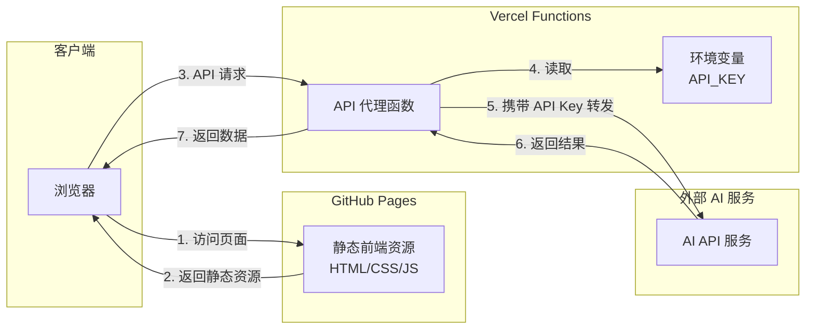
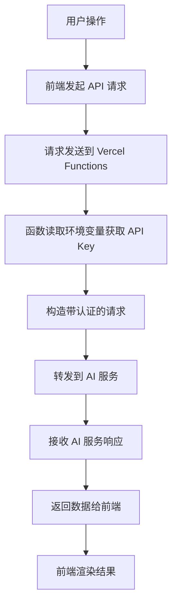

## Product Overview

慧食 AI 项目前后端分离部署方案，将现有项目拆分为前端静态资源和后端 API 服务两部分。前端部署到 GitHub Pages 提供免费稳定的静态托管，后端 API 部署到 Vercel Functions 作为 Serverless 函数运行，通过环境变量安全存储 API Key，避免敏感信息暴露在前端代码中。

## Core Features

- **前端静态部署**：将前端代码构建为静态资源，配置 GitHub Pages 自动部署
- **后端 API 代理**：创建 Vercel Serverless Functions 作为 API 代理层，转发请求到实际 AI 服务
- **API Key 安全保护**：通过 Vercel 环境变量存储敏感 API Key，后端代理注入请求头
- **跨域请求处理**：配置 CORS 允许 GitHub Pages 域名访问 Vercel API
- **前端 API 地址配置**：前端通过环境变量配置后端 API 地址，支持开发和生产环境切换

## Tech Stack

- **前端托管**：GitHub Pages（静态资源托管）
- **后端服务**：Vercel Functions（Serverless API）
- **构建工具**：保持现有项目构建配置
- **CI/CD**：GitHub Actions（自动构建部署）

## Tech Architecture

### System Architecture



### Module Division

- **前端模块**
- 主要职责：用户界面展示、用户交互处理
- 关键技术：现有前端框架
- 修改点：API 请求地址改为 Vercel Functions 地址

- **API 代理模块**
- 主要职责：接收前端请求、注入 API Key、转发到 AI 服务
- 关键技术：Vercel Serverless Functions
- 接口：`/api/*` 路由

- **部署配置模块**
- 主要职责：自动化构建和部署
- 关键技术：GitHub Actions、Vercel CLI

### Data Flow



## Implementation Details

### Core Directory Structure

```
project-root/
├── api/                          # Vercel Functions 目录（新增）
│   └── proxy.js                  # API 代理函数
├── src/                          # 前端源码（现有）
│   └── config/
│       └── api.js                # API 地址配置（修改）
├── .github/
│   └── workflows/
│       └── deploy.yml            # GitHub Actions 部署配置（新增）
├── vercel.json                   # Vercel 配置文件（新增）
└── package.json                  # 添加构建脚本
```

### Key Code Structures

**API 代理函数**：Vercel Serverless Function，负责接收前端请求，从环境变量读取 API Key，构造认证请求头后转发到实际 AI 服务。

```javascript
// api/proxy.js
export default async function handler(req, res) {
  // 设置 CORS 头
  res.setHeader('Access-Control-Allow-Origin', 'https://username.github.io');
  res.setHeader('Access-Control-Allow-Methods', 'GET, POST, OPTIONS');
  res.setHeader('Access-Control-Allow-Headers', 'Content-Type');
  
  // 从环境变量获取 API Key
  const apiKey = process.env.API_KEY;
  
  // 转发请求到 AI 服务
  const response = await fetch(AI_SERVICE_URL, {
    method: req.method,
    headers: {
      'Authorization': `Bearer ${apiKey}`,
      'Content-Type': 'application/json'
    },
    body: JSON.stringify(req.body)
  });
  
  const data = await response.json();
  res.status(200).json(data);
}
```

**前端 API 配置**：根据环境变量切换 API 地址，开发环境使用本地地址，生产环境使用 Vercel Functions 地址。

```javascript
// src/config/api.js
const API_BASE_URL = process.env.NODE_ENV === 'production'
  ? 'https://your-project.vercel.app/api'
  : 'http://localhost:3000/api';

export { API_BASE_URL };
```

### Technical Implementation Plan

**1. Vercel Functions API 代理**

- 问题：需要安全调用 AI 服务而不暴露 API Key
- 方案：创建 Serverless 函数作为代理层
- 步骤：创建 api 目录 → 编写代理函数 → 配置 CORS → 配置环境变量

**2. GitHub Pages 部署**

- 问题：前端静态资源需要自动部署
- 方案：使用 GitHub Actions 自动构建并部署到 gh-pages 分支
- 步骤：创建 workflow 文件 → 配置构建命令 → 设置部署目标

**3. 环境变量安全管理**

- 问题：API Key 不能出现在代码仓库中
- 方案：Vercel 环境变量 + GitHub Secrets
- 步骤：在 Vercel 控制台添加环境变量 → 在 GitHub 添加 Secrets

### Integration Points

- **前端与 Vercel API**：通过 HTTPS 请求，JSON 格式数据交换
- **Vercel API 与 AI 服务**：携带 Authorization 头的 HTTPS 请求
- **GitHub 与 GitHub Pages**：通过 GitHub Actions 自动部署
- **GitHub 与 Vercel**：通过 Git 推送触发 Vercel 自动部署

## Technical Considerations

### Security Measures

- API Key 仅存储在 Vercel 环境变量中，不进入代码仓库
- CORS 配置限制只允许特定域名访问
- 可选：添加请求频率限制防止滥用

### Performance Optimization

- Vercel Functions 冷启动优化：保持函数轻量
- 前端静态资源 CDN 加速（GitHub Pages 自带）

## Agent Extensions

### SubAgent

- **code-explorer**
- Purpose：探索现有项目结构，了解前端 API 调用方式和构建配置
- Expected outcome：获取项目目录结构、API 调用代码位置、现有构建脚本信息