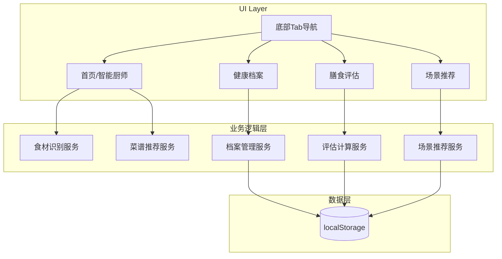
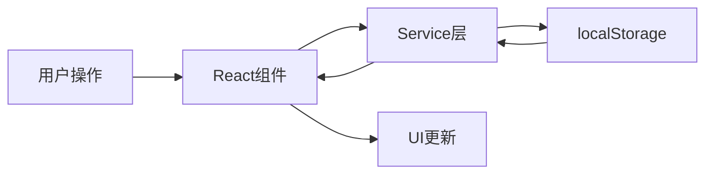

## 产品概述

慧食 AI 是一款智能膳食管理应用，帮助用户通过 AI 技术进行食材识别、菜谱推荐、健康管理和膳食评估。本次迭代将在现有食材识别和菜谱推荐基础上，新增用户健康档案、膳食评估、场景化推荐三大核心模块，并改造为底部 Tab 导航架构，实现完整的 MVP 功能闭环。

## 核心功能

### 底部 Tab 导航架构

- 四个主要 Tab：首页（智能厨师）、健康档案、膳食评估、场景推荐
- 统一的导航体验，支持快速切换各功能模块

### 智能厨师模块（现有功能完善）

- 食材拍照识别功能
- 基于识别结果的智能菜谱推荐
- 补充缺失的 ResultsSection 组件，展示识别结果和推荐菜谱

### 用户健康档案模块

- 基础信息录入：身高、体重、年龄、性别
- 健康目标设置：减脂、增肌、维持体重、健康饮食
- 饮食偏好配置：口味偏好、过敏原、忌口食材
- 健康数据本地存储与管理

### 膳食评估模块

- 每日饮食记录功能
- 营养摄入分析：热量、蛋白质、碳水、脂肪等
- 基于健康档案的个性化评估建议
- 可视化营养数据展示

### 场景化推荐模块

- 多场景菜谱推荐：早餐、午餐、晚餐、加餐
- 特殊场景支持：健身餐、减脂餐、家庭聚餐
- 结合用户健康档案的智能推荐算法

## 技术栈

- 前端框架：React + JavaScript
- 样式方案：Tailwind CSS
- 数据存储：localStorage 本地存储
- 构建工具：Vite

## 技术架构

### 系统架构



### 模块划分

**导航模块**

- 职责：管理底部 Tab 导航和页面路由
- 技术：React Router
- 接口：TabNavigation 组件

**智能厨师模块**

- 职责：食材识别、菜谱推荐、结果展示
- 依赖：现有识别逻辑
- 接口：ResultsSection 组件补充

**健康档案模块**

- 职责：用户健康信息的录入、存储、读取
- 技术：React Hooks + localStorage
- 接口：ProfileForm、ProfileDisplay 组件

**膳食评估模块**

- 职责：饮食记录、营养分析、评估建议
- 技术：营养计算算法
- 接口：MealRecord、NutritionChart 组件

**场景推荐模块**

- 职责：基于场景和用户档案的菜谱推荐
- 依赖：健康档案数据
- 接口：SceneSelector、RecommendList 组件

### 数据流



## 实现细节

### 核心目录结构

```
src/
├── components/
│   ├── layout/
│   │   └── TabNavigation.jsx      # 底部Tab导航
│   ├── home/
│   │   └── ResultsSection.jsx     # 识别结果展示（补充）
│   ├── profile/
│   │   ├── ProfileForm.jsx        # 档案表单
│   │   └── ProfileDisplay.jsx     # 档案展示
│   ├── assessment/
│   │   ├── MealRecord.jsx         # 饮食记录
│   │   └── NutritionChart.jsx     # 营养图表
│   └── scene/
│       ├── SceneSelector.jsx      # 场景选择
│       └── RecommendList.jsx      # 推荐列表
├── pages/
│   ├── HomePage.jsx               # 首页/智能厨师
│   ├── ProfilePage.jsx            # 健康档案页
│   ├── AssessmentPage.jsx         # 膳食评估页
│   └── ScenePage.jsx              # 场景推荐页
├── services/
│   ├── storageService.js          # localStorage封装
│   ├── profileService.js          # 档案服务
│   ├── assessmentService.js       # 评估服务
│   └── sceneService.js            # 场景服务
└── App.jsx                        # 路由配置
```

### 关键代码结构

**用户健康档案数据结构**

```javascript
// 健康档案接口定义
const UserProfile = {
  basicInfo: {
    height: Number,      // 身高(cm)
    weight: Number,      // 体重(kg)
    age: Number,         // 年龄
    gender: String       // 性别
  },
  healthGoal: String,    // 健康目标
  preferences: {
    taste: Array,        // 口味偏好
    allergens: Array,    // 过敏原
    restrictions: Array  // 忌口食材
  }
}
```

**localStorage 服务封装**

```javascript
// 存储服务核心方法
const storageService = {
  get: (key) => JSON.parse(localStorage.getItem(key)),
  set: (key, value) => localStorage.setItem(key, JSON.stringify(value)),
  remove: (key) => localStorage.removeItem(key)
}
```

### 技术实现要点

**底部 Tab 导航实现**

- 使用 React Router 实现页面路由
- 固定底部导航栏，支持图标和文字
- 当前激活 Tab 高亮显示

**健康档案本地持久化**

- 表单数据实时校验
- 提交时存储至 localStorage
- 页面加载时自动读取已有数据

**营养评估计算**

- 基于用户档案计算每日推荐摄入量
- 对比实际摄入与推荐值
- 生成可视化图表展示

## 设计风格

采用清新健康的现代设计风格，以绿色为主色调传达健康饮食理念。界面简洁明快，注重信息层次和可读性，通过卡片式布局组织内容，配合柔和的圆角和阴影营造轻盈感。

## 页面设计

### 底部 Tab 导航

- 固定于屏幕底部，高度 60px
- 四个 Tab 等宽分布：首页、档案、评估、推荐
- 图标+文字组合，激活态使用主色调高亮
- 背景白色，顶部添加细微阴影分隔

### 首页（智能厨师）

- 顶部区域：应用 Logo 和欢迎语
- 拍照识别区：大尺寸拍照按钮，支持点击上传
- 识别结果区：食材标签展示，支持编辑
- 菜谱推荐区：卡片式菜谱列表，含图片、名称、烹饪时间

### 健康档案页

- 顶部标题栏：页面标题和编辑按钮
- 基础信息卡片：身高、体重、年龄、性别的表单输入
- 健康目标卡片：单选按钮组选择目标类型
- 饮食偏好卡片：多选标签式选择口味和忌口

### 膳食评估页

- 日期选择器：顶部日期切换
- 饮食记录区：按餐次分组的食物记录列表
- 营养分析区：环形图展示热量摄入，条形图展示各营养素
- 评估建议区：基于数据的文字建议卡片

### 场景推荐页

- 场景选择区：横向滚动的场景标签（早餐、午餐、健身餐等）
- 推荐列表区：垂直滚动的菜谱卡片列表
- 卡片包含：菜品图片、名称、营养标签、适合人群

## Agent Extensions

### SubAgent

- **code-explorer**
- 用途：探索现有项目结构，了解当前代码架构、组件组织方式和已有功能实现
- 预期结果：获取项目目录结构、现有组件列表、路由配置等信息，确保新功能与现有代码风格一致